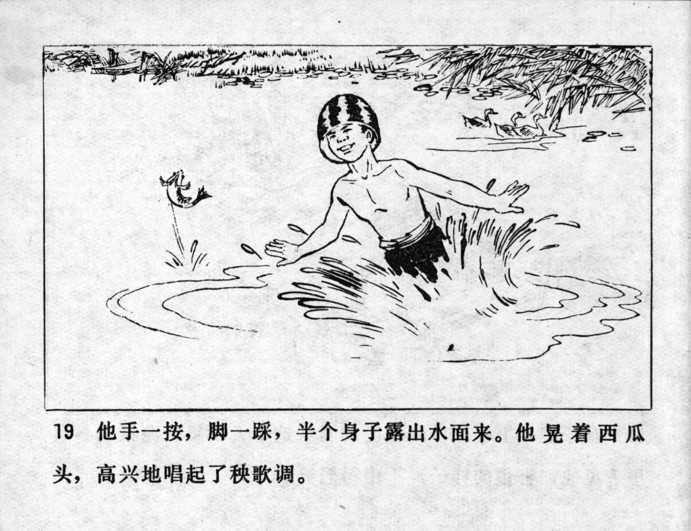



他手一按，脚一踩，半个身子露出水面来。他晃着西瓜头，高兴地唱起了秧歌调。

<--->

He pushed with his hands, stomped with his feet and the upper part of his body emerged from the water. He shook his watermelon head and happily began to sing a Yangge tune.


