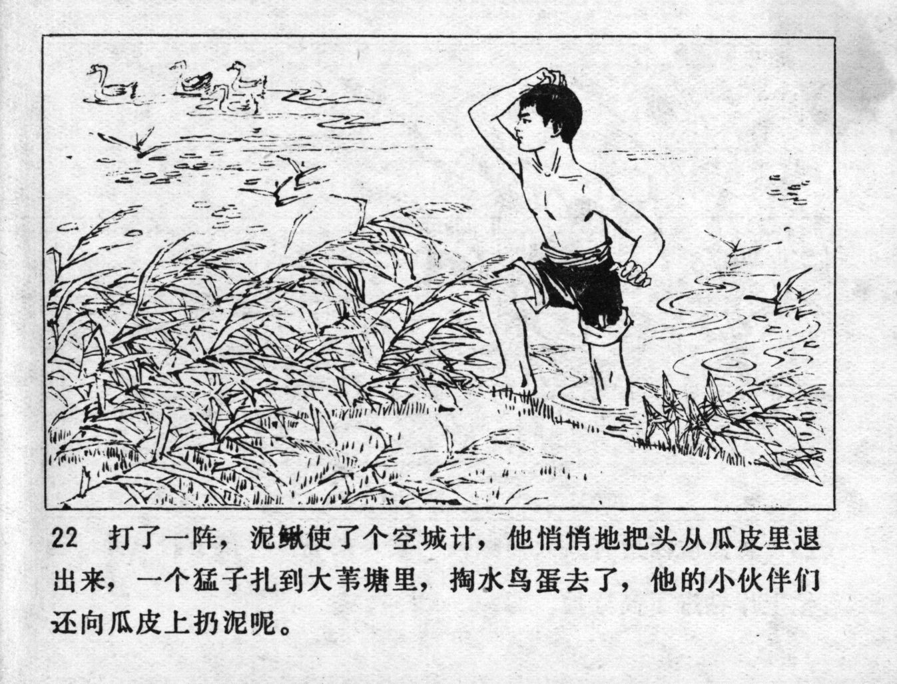



打了一阵，泥鳅使了个空城计，他悄悄地把头从瓜皮里退出来，一个猛子扎到大苇塘里，掏水鸟蛋去了，他的小伙伴们还向瓜皮上扔泥呢。

<--->

After fighting for a while, Niqiu made a feint. He carefully backed his head away from the watermelon, rapidly went into the big reed pond and went to dig for waterbird eggs. His comrades were still throwing mud at the watermelon skin.


