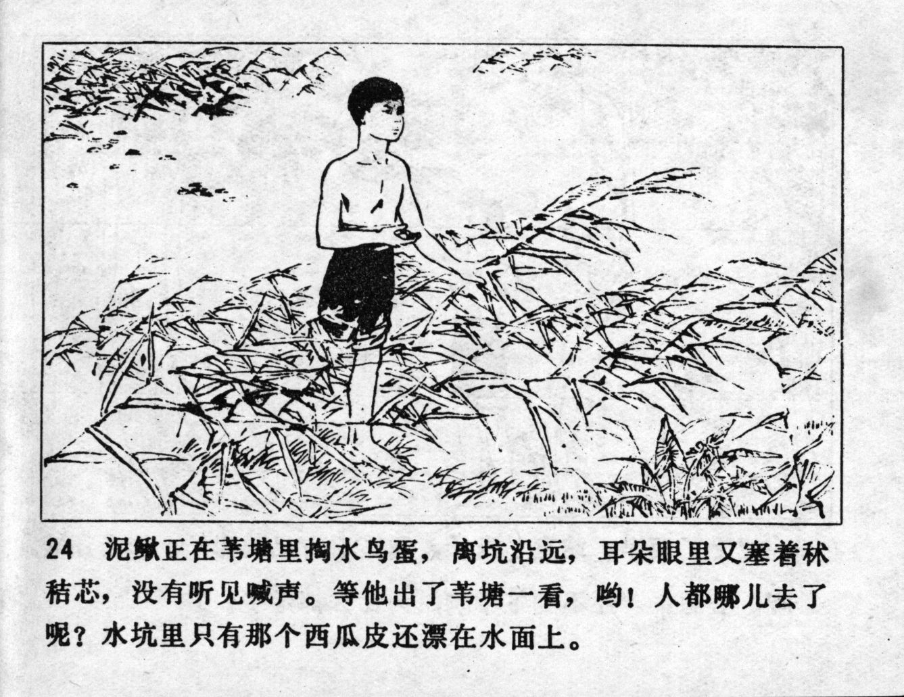



泥鳅正在苇塘里掏水鸟蛋，离坑沿远，耳朵眼里又塞着秫秸芯，没有听见喊声。等他出了苇塘一看，哟！人都哪儿去了呢？水坑里只有那个西瓜皮还漂在水面上。

<--->

In the reed pond Niqiu was digging for water bird eggs, far away from the edge of the pond, and since his ears and eyes were filled with sorghum sticks, he did not hear the shout. When he got out of the reed and looked around, he thought: "Oh! Where is everyone?" Only the watermelon skin was still floating on the surface of the water.


