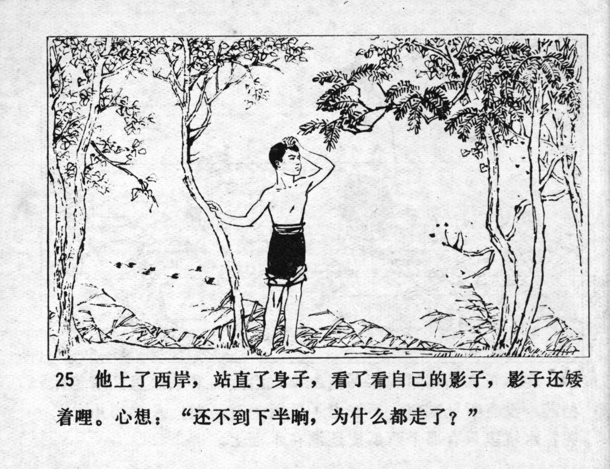



他上了西岸，站直了身子，看了看自己的影子，影子还矮着哩。心想：“还不到下半晌，为什么都走了？”

<--->

He got onto the west bank, stood up straight and looked at his shadow which was still short. He thought: "It's not yet afternoon, why did they all leave?"


