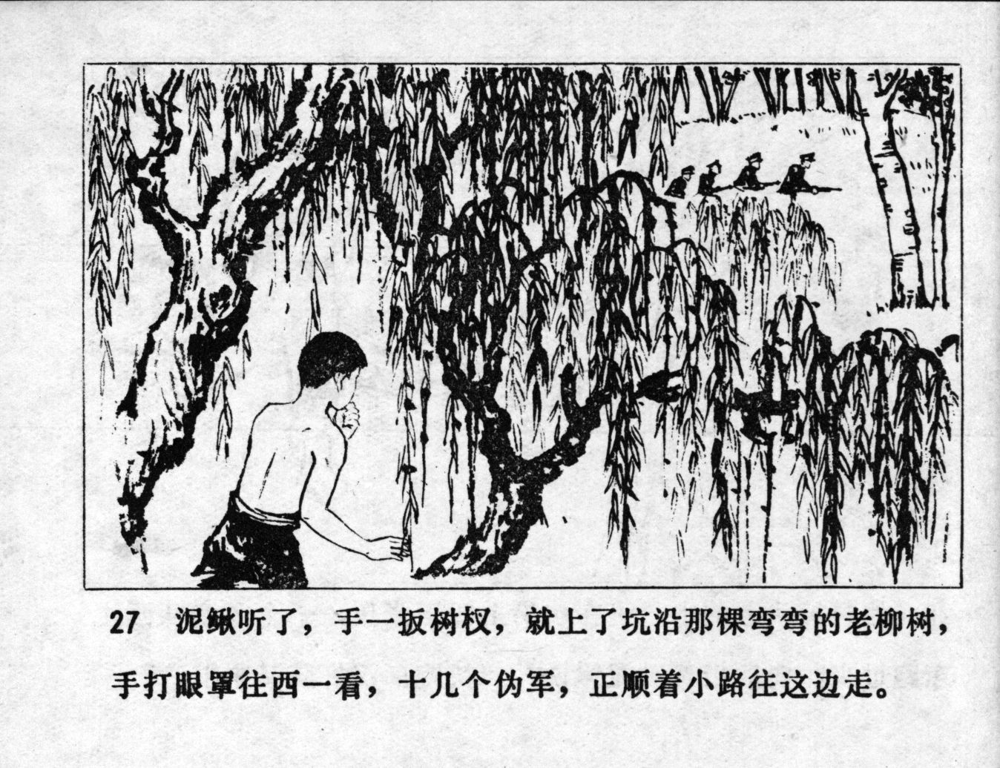



泥鳅听了，手一扳树杈，就上了坑沿那棵弯弯的老柳树，手打眼罩往西一看，十几个伪军，正顺着小路往这边走。

<--->

When Niqiu heard this, he grabbed a tree branch and pulled himself up onto the curved old willow tree at the pond. Using his hand as a visor, he looked westwards and saw a dozen or so puppet soldiers walking along a small path towards him.


