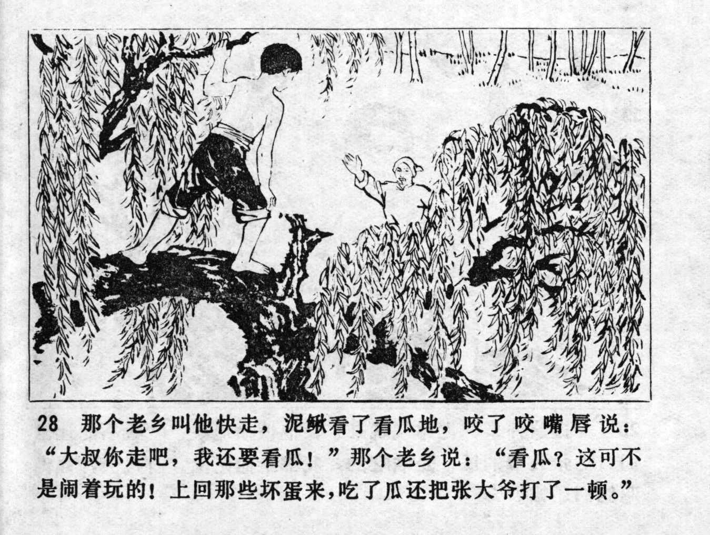



那个老乡叫他快走，泥鳅看了看瓜地，咬了咬嘴唇说：“大叔你走吧，我还要看瓜！”那个老乡说：“看瓜？这可不是闹着玩的！上回那些坏蛋来，吃了瓜还把张大爷打了一顿。”

<--->

The villager told him to run away, but Niqiu looked at the melon patch, bit his lip and said: "You go ahead, Uncle! I need to watch over the melons!" The villager answered: "Watch over the melons? This is not a joke! Last time those bastards came, they ate the melons and beat up Uncle Zhang."


