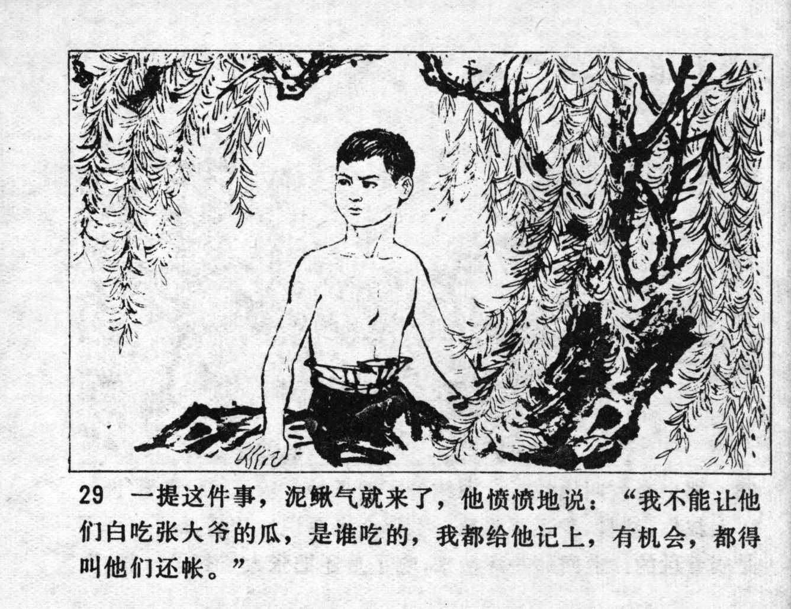



一提这件事，泥鳅气就来了，他愤愤地说：“我不能让他们白吃张大爷的瓜，是谁吃的，我都给他记上，有机会，都得叫他们还帐。”

When this was mentioned, Niqiu's anger rose again. He said angrily: "I can't let them eat Uncle Zhang's melons for free. Whoever ate them, I'll put that on his bill, and I'll make them pay for it when I get the chance."


