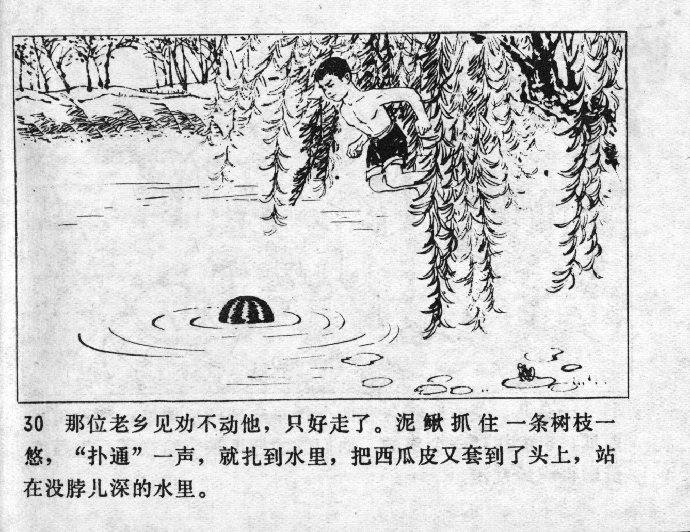



那位老乡见劝不动他，只好走了。泥鳅抓住一条树枝一悠，“扑通”一声，就扎到水里，把西瓜皮又套到了头上，站在没脖儿深的水里。

<--->

The villager saw that Niqiu could not be persuaded, so he could only walk away. Niqiu grabbed a long tree branch, swung himself and - SPLASH - plunged into the water. He put the watermelon skin on his head again and stood in the water which did not reach his neck.


