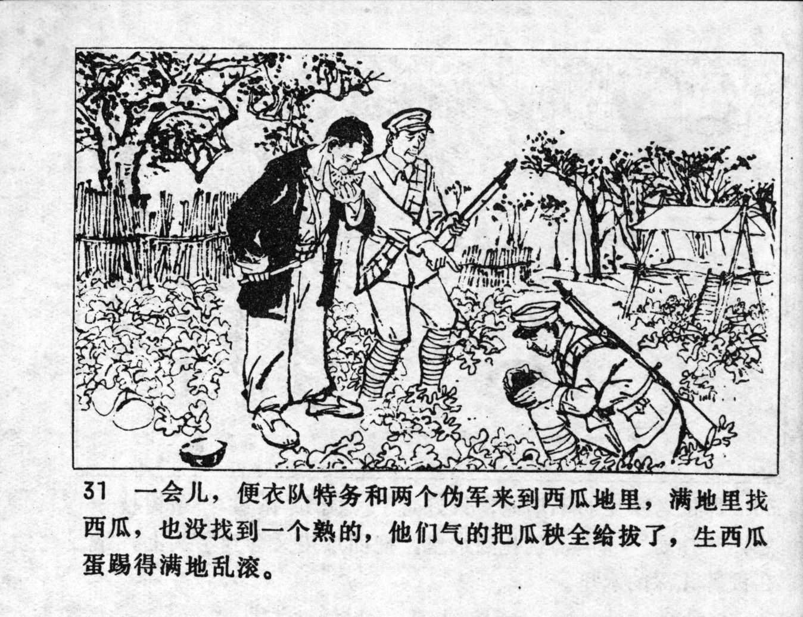



一会儿，便衣队特务和两个伪军来到西瓜地里，满地里找西瓜，也没找到一个熟的，他们气的把瓜秧全给拔了，生西瓜蛋踢得满地乱滚。

<--->

After a while, a plain clothes spy and two puppet soldiers came to the watermelon patch and searched the whole ground for melons but could not find a single ripe one. They became so angry that they pulled up all the melon seedlings and kicked the unripe melons all over the place.


