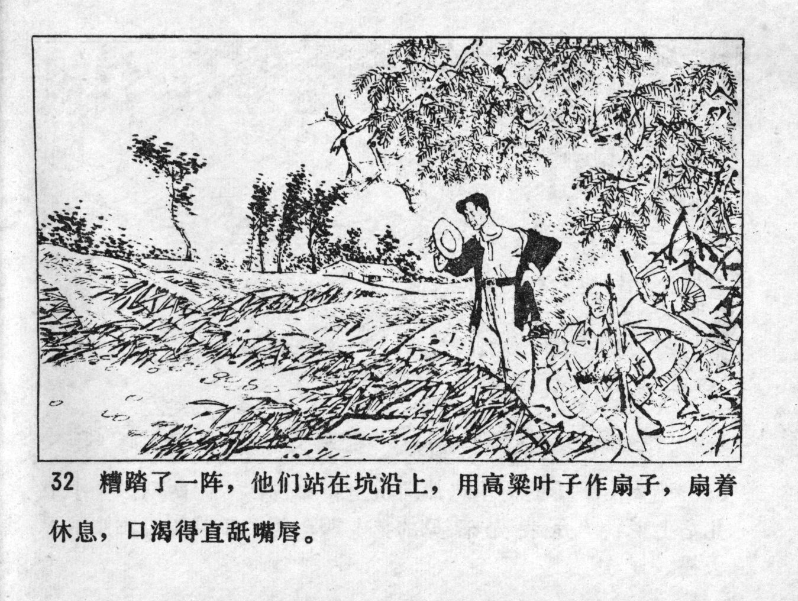



糟踏了一阵，他们站在坑沿上，用高粱叶子作扇子，扇着体息，口渴得直舐嘴唇。

<--->

After trampling for a while, they stood on the edge of the pond and used sorghum leaves as fans. Fanning, they rested and licked their lips with thirst.


