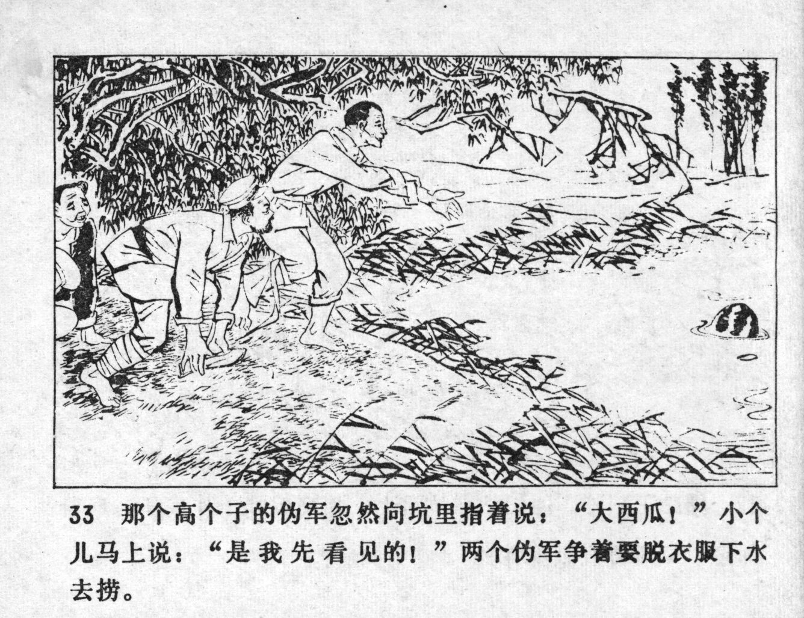



那个高个子的伪军忽然向坑里指着说：“大西瓜！”小个儿马上说：“是我先看见的！”两个伪军争着要脱衣服下水去捞。

<--->

Suddenly, the tall puppet soldier pointed at the pond and said: "Look at the huge watermelon!" The short one immediately replied: "I saw it first!" The two puppet soldiers vied to undress in order to get into the water and fish it out.


