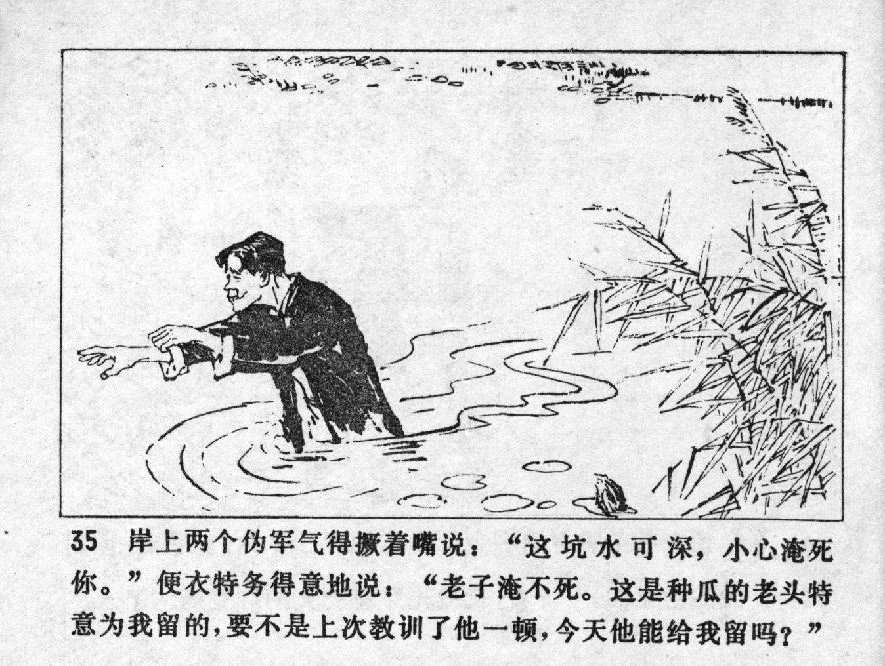



岸上两个伪军气得撅着嘴说：“这坑水可深，小心淹死你。”便衣特务得意地说：“老子淹不死。这是种瓜的老头特意为我留的，要不是上次教训了他一顿，今天他能给我留吗？”

<--->

Pouting with anger, the two puppet soldiers on the bank said: "That pond is really deep, be careful not to drown." The spy said proudly: "I won't drown. The old man who grows melons reserved this one especially for me. If I hadn't taught him a lesson last time, would he have saved one for me today?"


