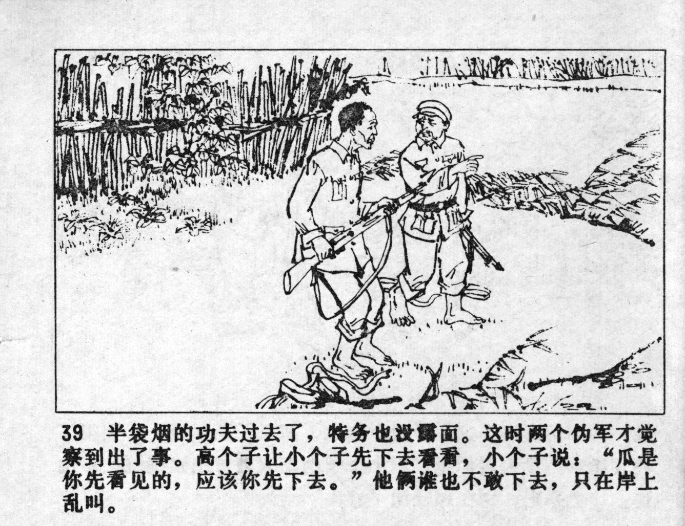



半袋烟的功夫过去了，特务也没露面。这时两个伪军才觉察到出了事。高个子让小个子先下去看看，小个子说：“瓜是你先看见的，应该你先下去。”他俩谁也不敢下去，只在岸上乱叫。

<--->

They smoked half a pack of cigarettes, yet the spy did not reappear. Only now, the two soldiers realized that something was wrong. The tall one ordered the small one to go down first and take a look, but the small one said: "You saw the melon first, so you should be the one to go down there first." Neither of them dared to go down, they just stood at the bank and shouted.


