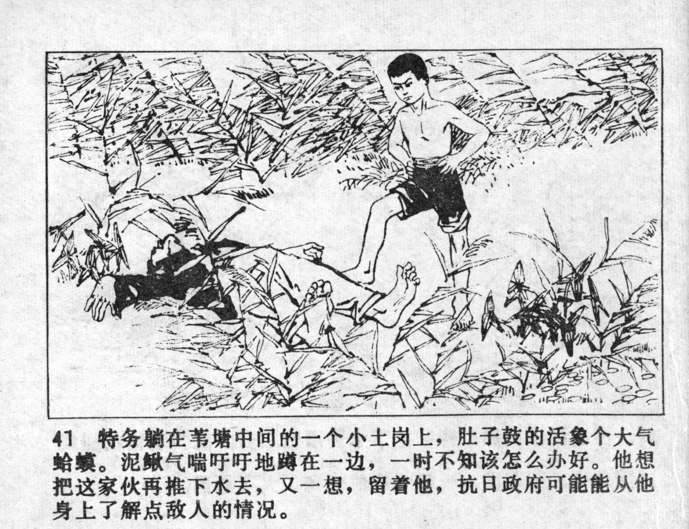



特务躺在苇塘中间的一个小土岗上，肚子鼓的活象个大气蛤蟆。泥鳅气喘吁吁地蹲在一边，一时不知该怎么办好。他想把这家伙再推下水去，又一想，留着他，抗日政府可能能从他身上了解点敌人的情况。

<--->

The spy laid on a small hill in the middle of the reed pond. His big belly resembled a huge toad. Breathing heavily, Niqiu sat next to him. All of a sudden, he did not know what to do. He wanted to drag the guy back into the water, but thought it over. He could leave him so that the anti-Japanese government might learn something about the situation of the enemy from him.


