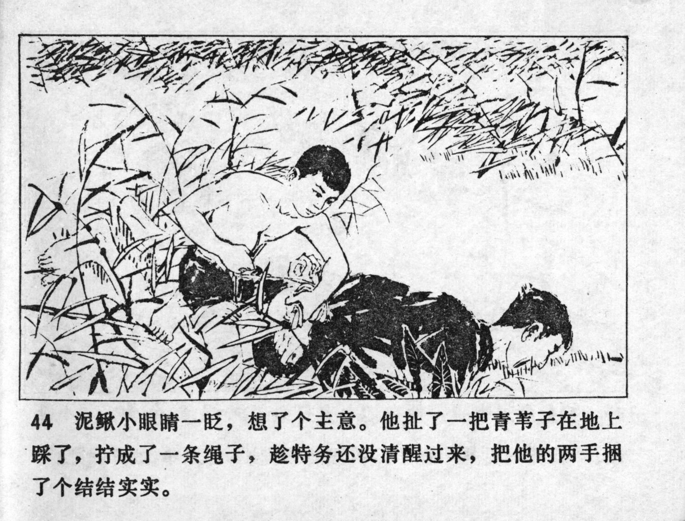



泥鳅小眼睛一眨，想了个主意。他扯了一把青苇子在地上踩了，拧成了一条绳子，趁特务还没清醒过来，把他的两手捆了个结结实实。

<--->

Niqiu blinked with his small eyes and had an idea. He pulled a handful of green reeds, stepped them on the ground, twisting them into a rope. While the spy was still unconscious, he tied his hands together tightly.


