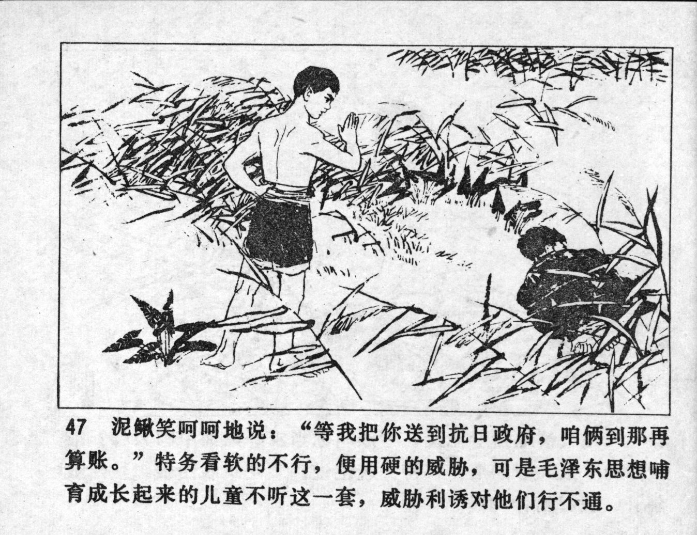



泥鳅笑呵呵地说：“等我把你送到抗日政府，咱俩到那再算账。”特务看软的不行，便用硬的威胁，可是毛泽东思想哺育成长起来的儿童不听这一套，威胁利诱对他们行不通。

<--->

Niqiu laughed: "Just wait until I have sent you to the anti-Japanese government, we will settle our accounts there." When the spy saw that soft words would not work, he used hard threats, but children raised by Mao Zedong\'s Thought do not listen to such kinds of threats, and temptations have no effect on them.


