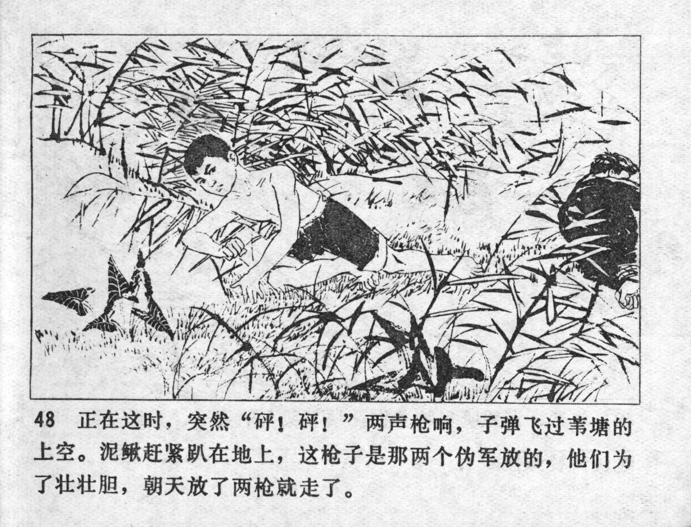



正在这时，突然“砰! 砰！”两声枪响，子弹飞过苇塘的上空。泥鳅赶紧趴在地上，这枪子是那两个伪军放的，他们为了壮壮胆，朝天放了两枪就走了。

<--->

At that moment -- BANG, BANG! -- suddenly two shots rang out, and the bullets flew over the reed pond. Niqiu hurriedly got down on the ground. The two puppet soldiers had fired the shots. In order to strengthen their courage, they had fired the two shots towards the sky and fled.


