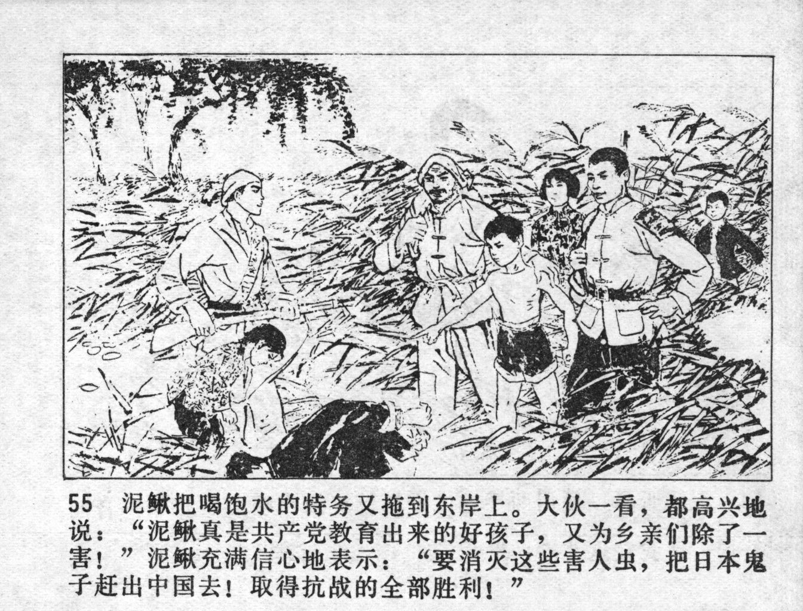



泥鳅把喝饱水的特务又拖到东岸上。大伙一看，都高兴地说：“泥鳅真是共产党教育出来的好孩子，又为乡亲们除了一害！”泥鳅充满信心地表示：“要消灭这些害人虫,把日本鬼子赶出中国去！取得抗战的全部胜利！”

<--->

Niqiu pulled the spy, who had had enough to drink, to the east bank. When everybody saw this, they happily said: "Niqiu is a good boy educated by the Communist Party, he averted yet another harm to the villagers!" Niqiu said with confidence: "Let's destroy this vermin and drive the Japanese devils out of China! Let's achieve total victory in the war!"


