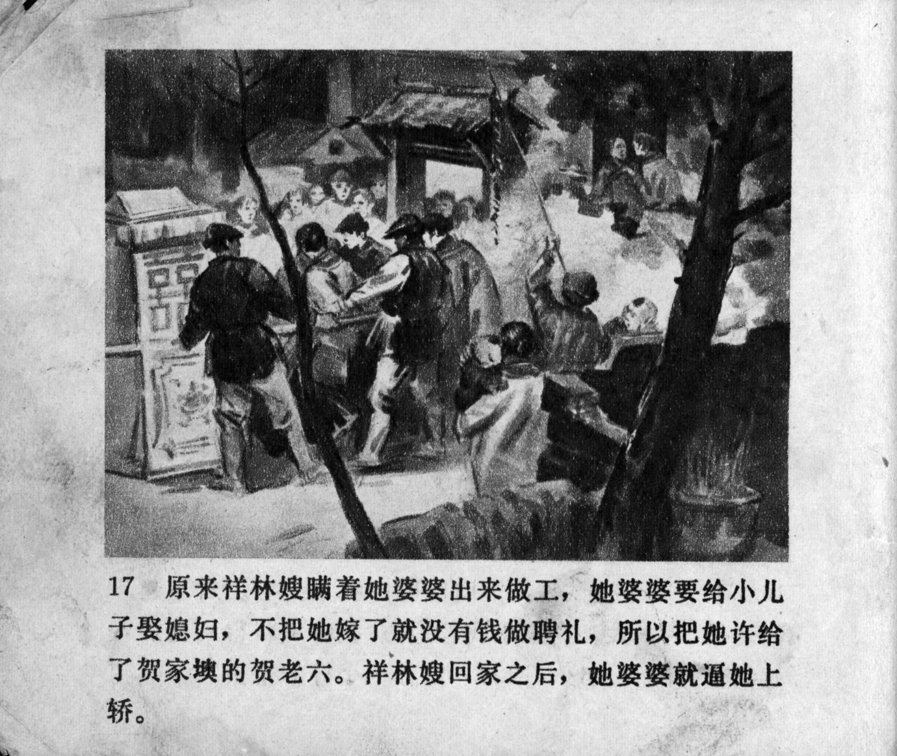



原来祥林嫂瞒着她婆婆出来做工, 她婆婆要给小儿子娶媳妇，不把她嫁了就没有钱做聘礼，所以把她许给了贺家墺的贺老六。祥林嫂回家之后，她婆婆就逼她上轿。

<--->

As it turned out, Xianglin's wife had left for work without telling her mother-in-law. Her mother-in-law wanted to find a wife for her younger son, and without the income from marrying her off they could not afford to pay the bride price. Xianglin\'s wife was thus promised to He Laoliu of Hejia Village. After Xianglin's wife came home, her mother-in-law forced her to enter the bridal sedan chair.


