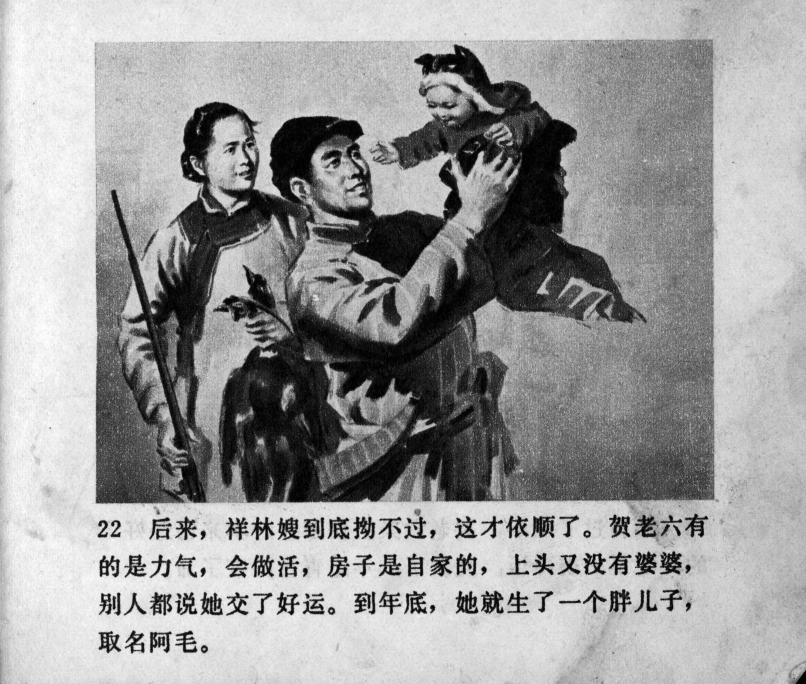



后来，祥林嫂到底拗不过，这才依顺了。贺老六有的是力气，会做活，房子是自家的，上头又没有婆婆，别人都说她交了好运。到年底，她就生了一个胖儿子，取名阿毛。

<--->

At last, Xianglin's wife was unable to resist any longer, and she obeyed. He Laoliu had strength, he could work, the house was his family's, and there was no mother-in-law over her head, so others said that she hit the jackpot. At the end of the year, she gave birth to a plump son named Ah Mao.


