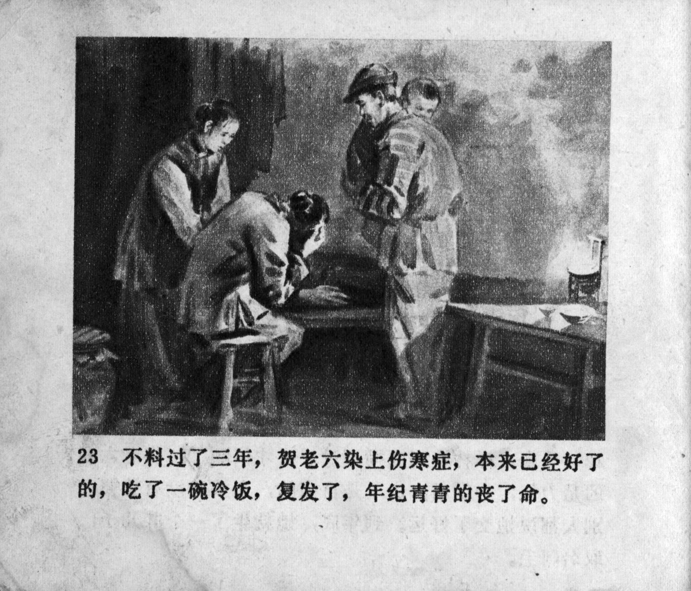



不料过了三年，贺老六染上伤寒症，本来已经好了的，吃了一碗冷饭，复发了，年纪青青的丧了命。

<--->

Unexpectedly, after three years, He Laoliu caught typhoid fever. He had already recovered, but after eating a bowl of cold rice, he relapsed and died at a young age.


