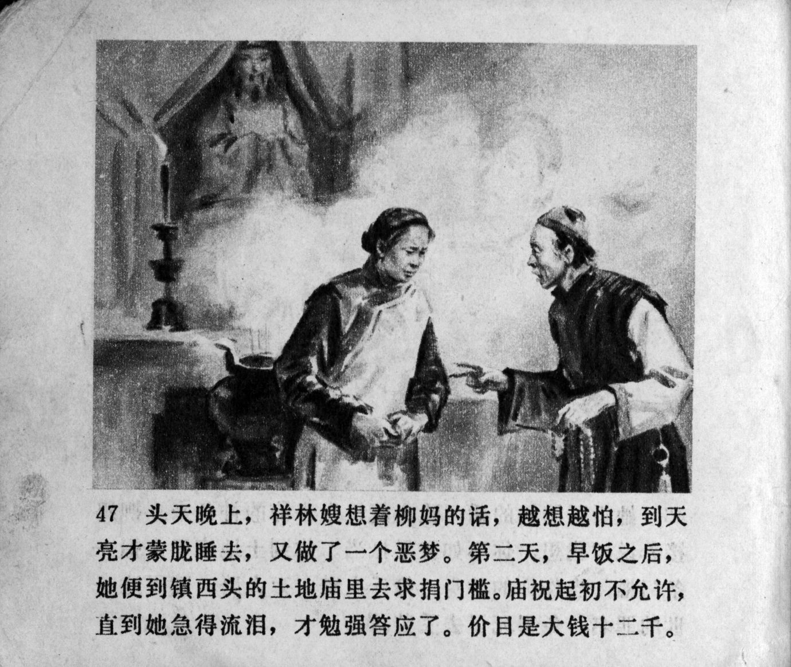



头天晚上，祥林嫂想着柳妈的话，越想越怕，到天亮才蒙胧睡去，又做了一个恶梦。第二天，早饭之后，她便到镇西头的土地庙里去求捐门槛。庙祝起初不允许，直到她急得流泪，才勉强答应了。价目是大钱十二千。

<--->

That evening, Xianglin's wife thought about Auntie Liu's words, the more she thought about it the more afraid she became. Only at dawn did she fall into a hazy sleep, and even then she had a nightmare. The next day, after breakfast, she went to the Temple of the Village God at the west end of town to ask to donate a threshold. At first, the temple attendant did not give his permission, only when she shed tears out of fear did he grudgingly agree. The price was twelve thousand large copper coins.


