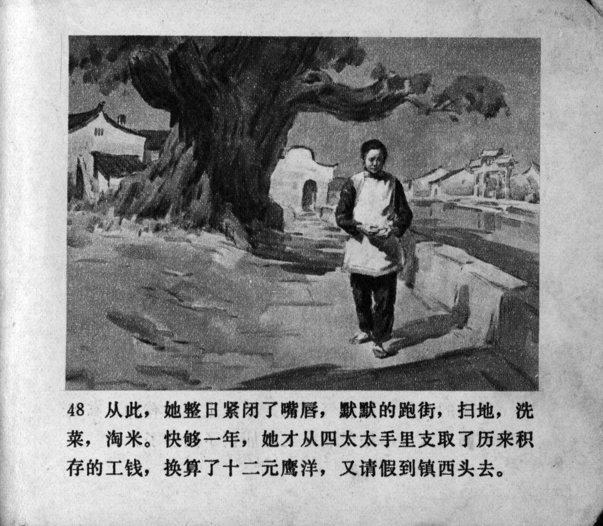



从此，她整日紧闭了，默默的跑街，扫地，洗菜，淘米。快够一年，她才从四太太手里支取了历来积存的工钱，换算了十二元鹰洋，又请假镇西头去。

<--->

From then on, she became entirely closed off, silently walking the streets, sweeping the floor, washing vegetables and rinsing rice. It was almost a year later when she asked Mrs. Lu for her accumulated wages, adding up to 12 yuan and again took leave to go to the west end of the town.


