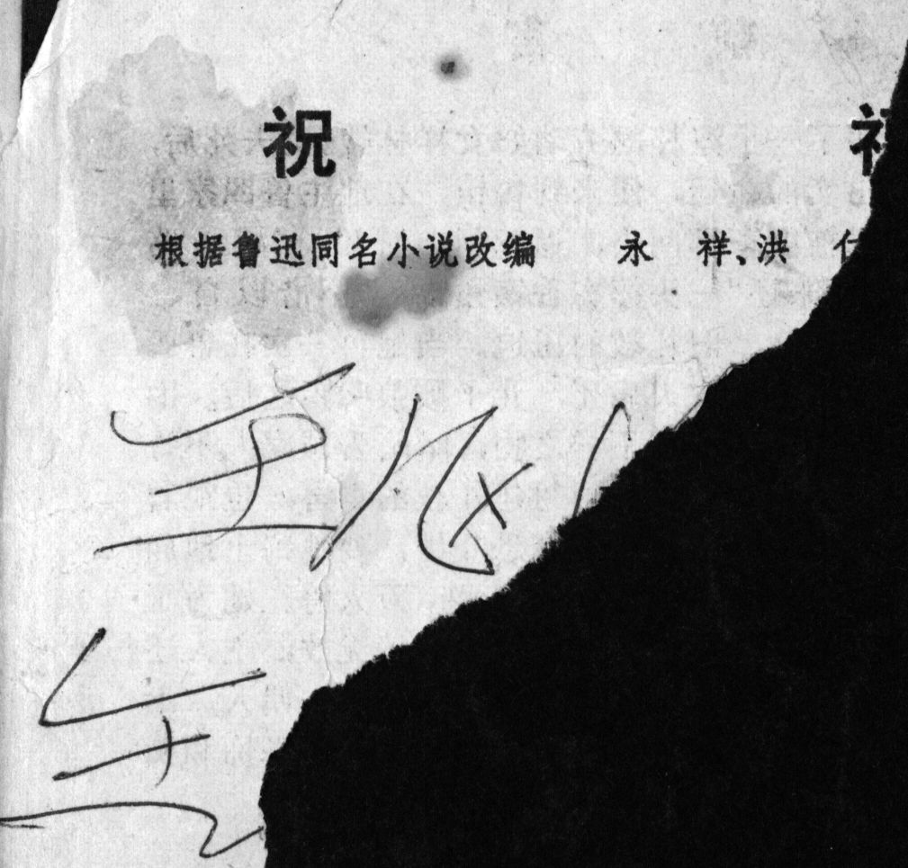

## Preface to the 1957 edition 

(not shown above)



### 内容说明

祥林嫂年轻的时候死了丈夫，便到鲁四老爷家帮工。后来她婆婆又强迫她嫁人。不久她的第二个丈夫病死了，她的儿子被狼吃掉了，她被生活所逼，只好又回到鲁四老爷家里。鲁四老爷厌恶她死过两个丈夫，说她不干净，败坏风俗。她怪自己的命不好，听了柳妈的话，到土地庙里捐一条门槛，当撖替身赎罪，可是人家还一样鄙视她。她更加衰老了，精神更迟钝了，终于她被赶出了鲁家，变成乞丐死了。

<--->

### Explanation of the contents

After Xianglin's wife lost her husband early in life, she comes to the Lu household as a servant. Later on, her mother-in-law forces her to remarry. Soon after, her second husband dies of illness, and her son is eaten by a wolf. She has no choice but to return to the Lu household. Mr. Lu loathes that she lost two husbands. He declares that she is tainted and would exert a bad moral influence. She also blames her own bad fate. After listening to Auntie Liu advice, she donates a threshold to the Temple of the Village God to atone for her sins, but people continue to despise her. She ages (prematurely) and becomes slow-witted. In the end, she is thrown out by the Lu family, turns into a beggar, and dies.


