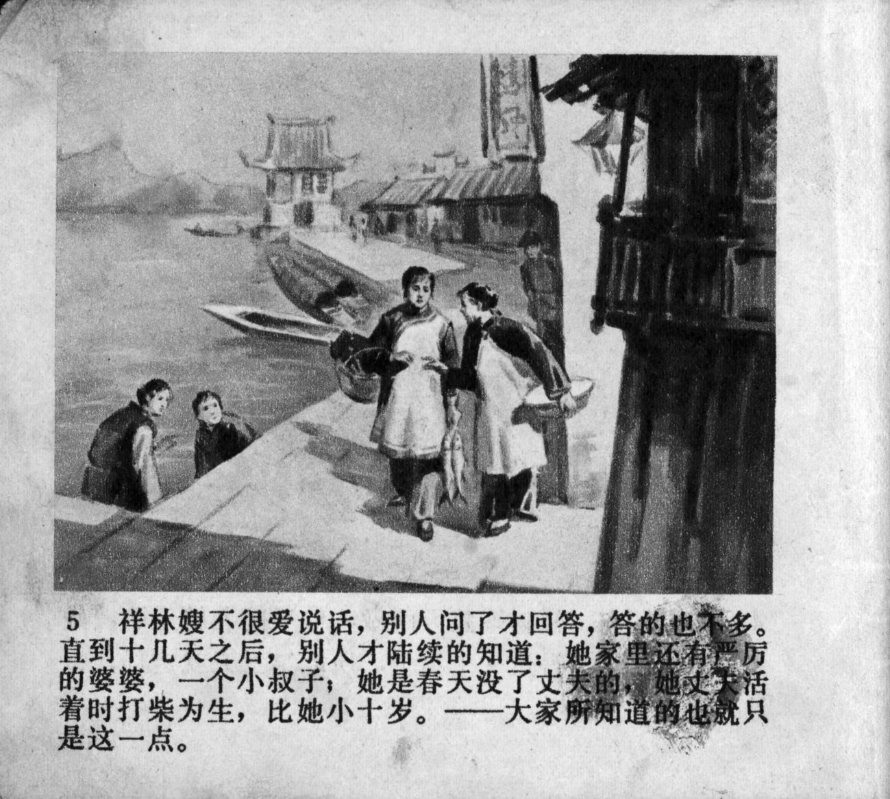



祥林嫂不很爱说话，别人问了才回答，答的也不多。直到十几天之后，别人陆续的知道：她家里还有严厉的婆婆，一个小叔子；她是春天没了丈夫的，她丈夫活着时打柴为生，比她小十岁。大家所知道的也就只是这一点。

<--->

Xianglin's wife did not talk much and answered only when addressed, and her answers were brief. A dozen days had passed before other people learned bit-by-bit, that she had a harsh mother-in-law at home and a younger brother-in-law; she had lost her husband in the spring; her husband, 10 years younger than her, had gathered firewood for a living before he died. These were all that people knew about her.


