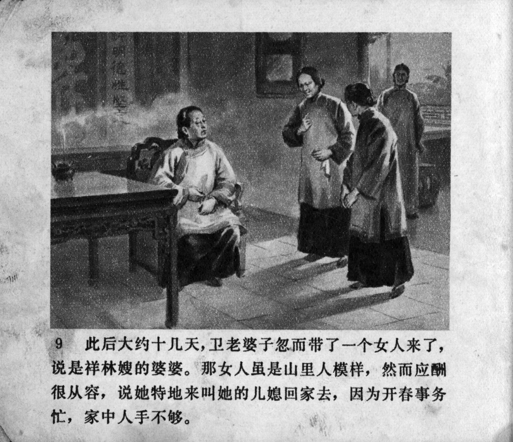



此后大约十几天，卫老婆子忽而带了一个女人来了，说是祥林嫂的婆婆。那女人虽是山里人模样，然而应酬很从容，说她特地来叫她的儿媳回家去，因为开春事务忙，家中人手不够。

<--->

About ten days later, Old Wei suddenly brought a woman, saying that she was the mother-in-law of Xianglin's wife. Although the woman looked like a peasant from the mountains, her social manner was very decent. She explained that she was here to take her daughter-in-law back home as her family was short of labor in the start of a busy spring.


