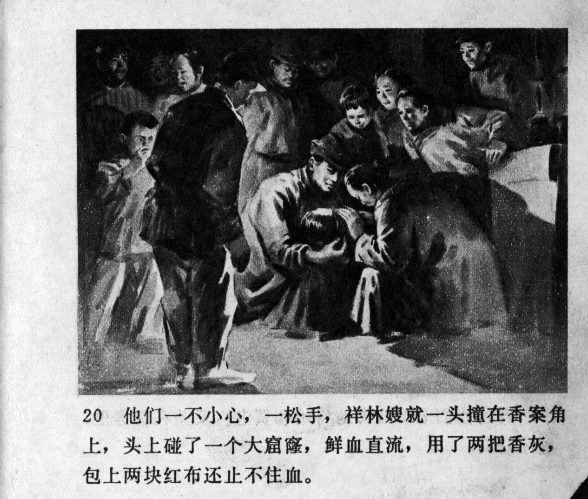



他们一不小心，一松手，祥林嫂就一头撞在香案角上，头上碰了一个大窟窿，鲜血直流，用了两把香灰,包上两块红布还止不住血。

<--->

When they, for a second, accidentally loosened their grip, Xianglin's wife rammed her head into the corner of the incense burner table. She struck a large hole into her head, and fresh blood was flowing. They put two handfuls of incense ash on the wound and wrapped it with two pieces of red cloth, but they still could not stop the blood flow.


