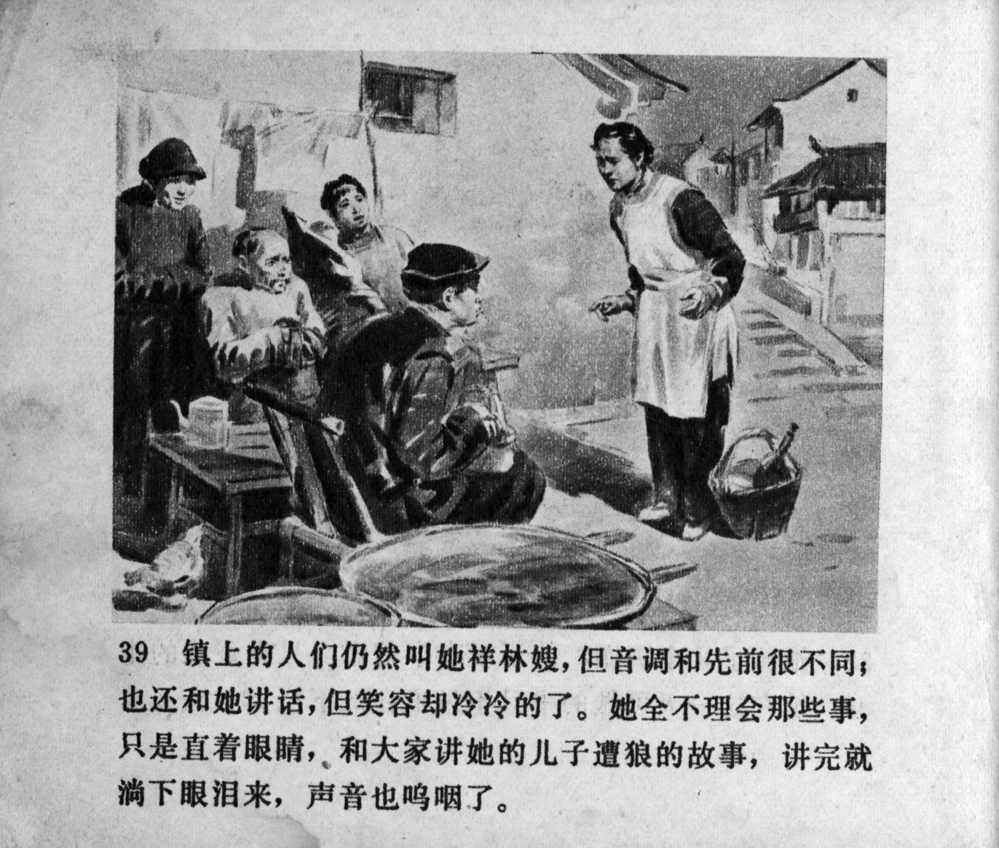



镇上的人们仍然叫她祥林嫂，但音调和先前很不同；也还和她讲话，但笑容却冷冷的了。她全不理会那些事，只是直着眼睛，和大家讲她的儿子遭狼的故事，讲完就淌下眼泪来，声音也呜咽了。

<--->

Townspeople still called her Xianglin's wife, but the tone was very different from before. They still talked with her, but their smiles had turned cold. She ignored those things, and with straight eyes she told everyone the story of how her son had been attacked by a wolf. When she finished her tale, she shed tears and her voice choked with sobs.


