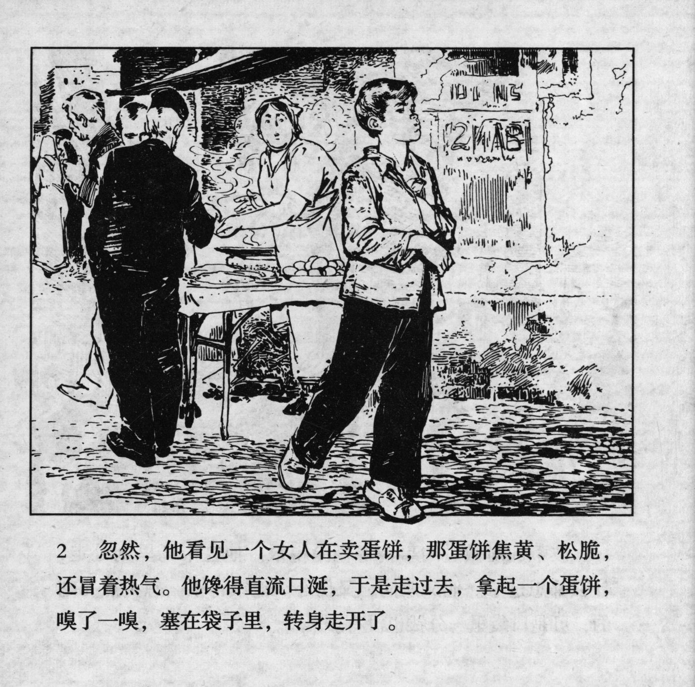



忽然，他看见一个女人在卖蛋饼，那蛋饼焦黄、松脆，还冒着热气。他馋得直流 口涎，于是走过去，拿起一个蛋饼，嗅了一嗅，塞在袋子里，转身走开了。

<--->

All of a sudden, he saw a woman selling pancakes which were brown, crisp and gave off hot steam. His mouth was watering, so he went and took one of the pancakes, smelled it, stuffed it in his pocket, turned around and walked away.


