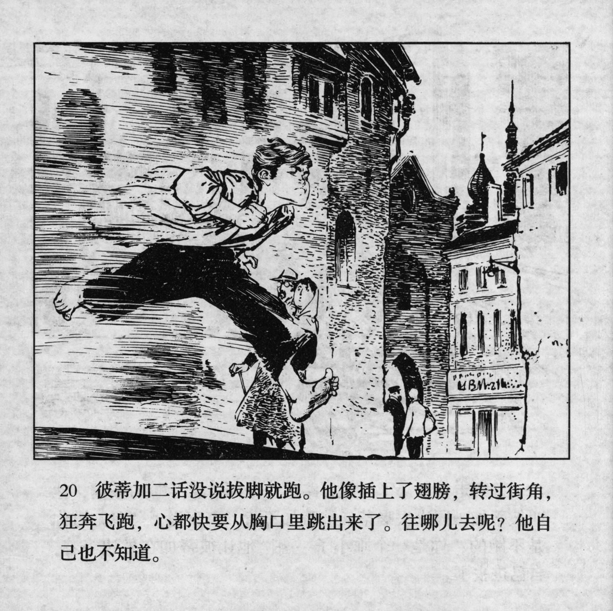

 



彼蒂加二话没说拔脚就跑。他像插上了翅膀，转过街角，狂奔飞跑，心都快要从胸口里跳出来了。往哪儿去呢？他自己也不知道。

<--->

Without another word, Petka turned around and ran. He seemed to have grown wings, he turned around the corner and his heart was about to jump out of his chest. Where should he go? He did not know himself.


