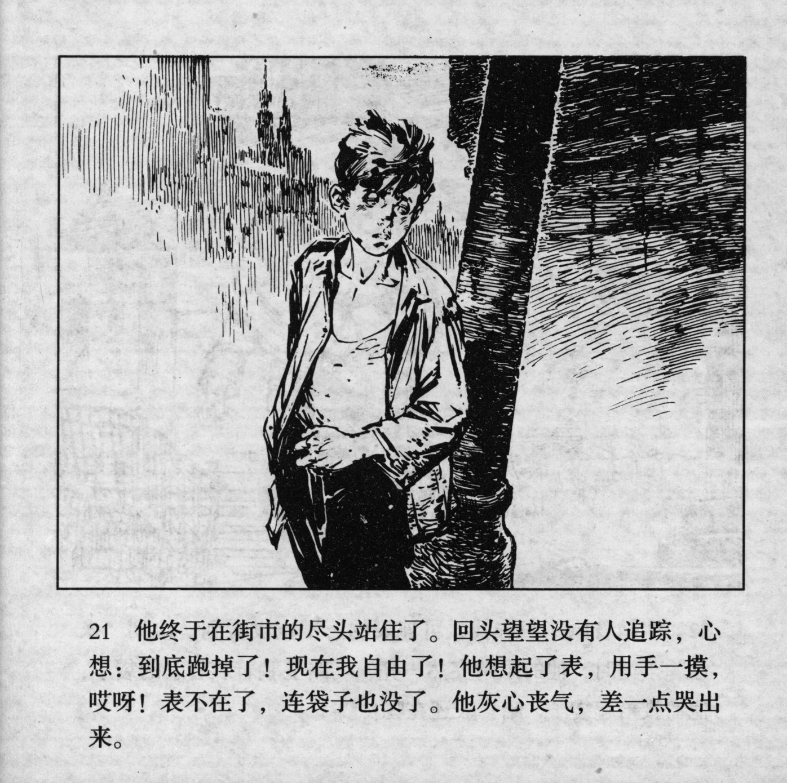



他终于在街市的尽头站住了。回头望望没有人追踪，心想：到底跑掉了! 现在我自由了! 他想起了表，用手一摸，哎呀! 表不在了，连袋子也没了。他灰心丧气，差一点哭出来。

<--->

Finally, he stopped at the end of the market. He turned around and saw that no one was following him, thinking: "In the end I got away! Now I'm free!" He remembered the watch and felt for it. OH NO! The watch was gone, even his pocket had disappeared. He was so disheartened that he almost began to cry.


