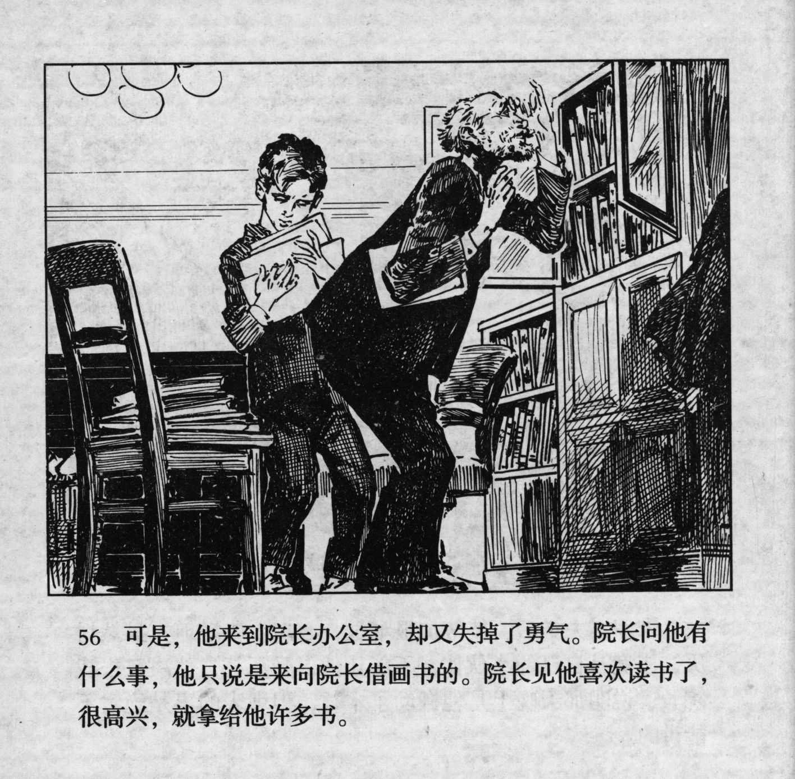



可是，他来到院长办公室，却又失掉了勇气。院长问他有什么事，他只说是来向院长借画书的。院长见他喜欢读书了，很高兴，就拿给他许多书。

<--->

However, when he arrived in the director's office, his courage left him. The director asked him what the matter was, but he only managed to say that he had come to borrow some picture books from him. When the director saw that he liked reading, he was very happy, and gave him many books.


