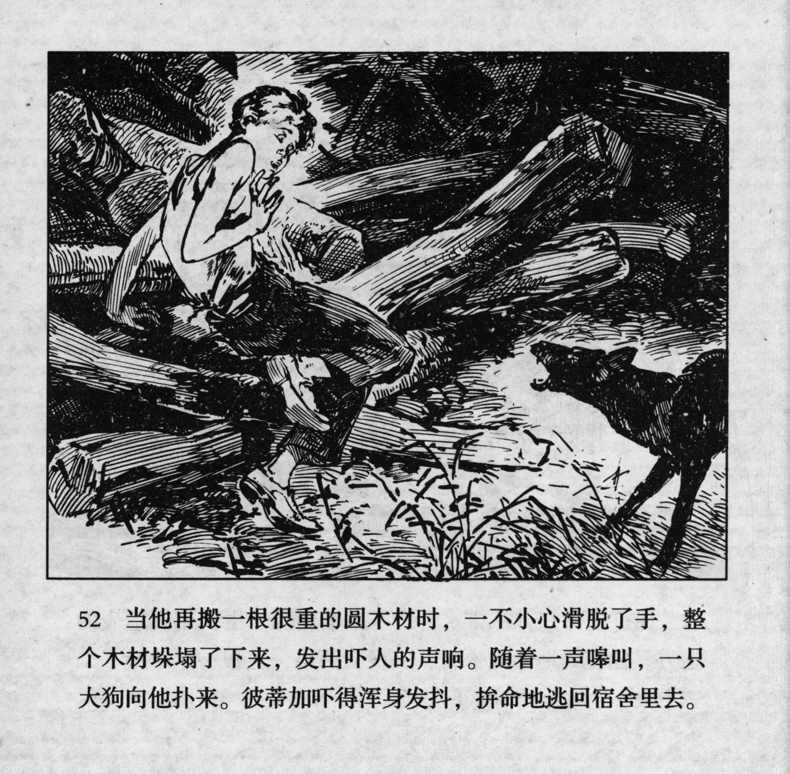



当他再搬一根很重的圆木材时，一不小心滑脱了手，整个木材垛塌了下来，发出吓人的声响。随着一声嗥叫，一只大狗向他扑来。彼蒂加吓得浑身发抖，拚命地逃回宿舍里去。

<--->

Just when he was pulling one especially heavy log, it slipped out of his hands in a moment of carelessness. The entire pile of tree trunks collapsed, making a frightening noise. Following a loud growl, a huge dog jumped at Petka. Petka\'s entire body trembled with fear, and he ran back to the dorm for his dear life.


