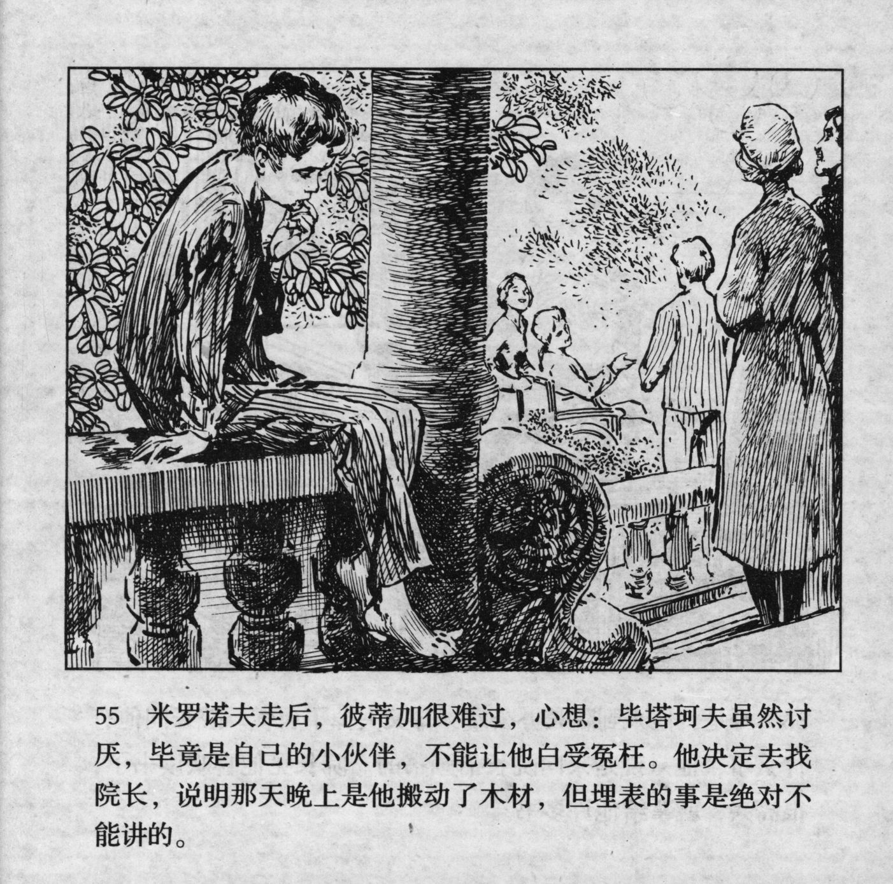



米罗诺夫走后，彼蒂加很难过，心想：毕塔珂夫虽然讨厌，毕竟是自己的小伙伴，不能让他白受冤在。他决定去找院长，说明那天晚上是他搬动了木材，但埋表的事是绝对不能讲的。

<--->

After Milonov had left, Petka felt very bad and thought to himself: "Even though I detest Pyatakov, he is still my mate, and I can't let him be accused wrongly." He decided that he would go to the director and explain that it had been Petka himself, who had moved the logs on that very night, but he would not say a word about the watch.


