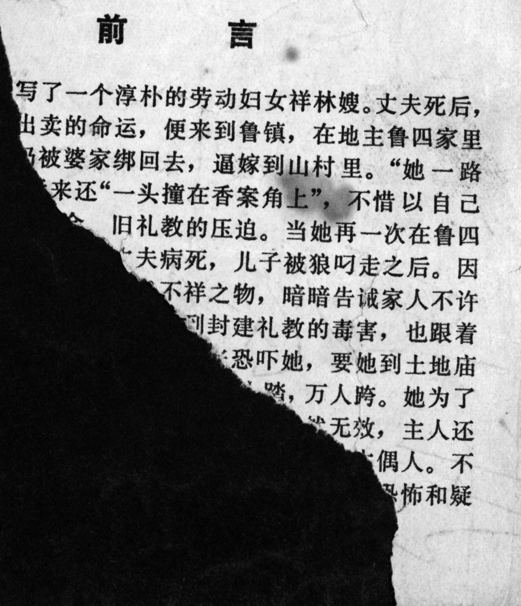



## 前言

《祝福》描写了一个淳朴的劳动妇女祥林嫂。丈夫死后,她为了逃避被出卖的命运，便来到鲁镇，在地主鲁四家里做工。但不久仍被婆家绑回去，逼嫁到山村里。"她一路只是嚎，骂"，后来还"一头撞在香案角上"，不惜以自己的生命来反抗旧社会、旧礼教的压迫。当她再一次在鲁四家里出现，那是第二个丈夫病死，儿子被狼叼走之后。因她再嫁再寡，鲁四把她看成不祥之物，暗暗告诫家人不许她沾手祭品。镇上的人由于受到封建礼教的毒害，也跟着嘲笑她。柳妈又以"阴间"的锯刑来恐吓她，要她到土地庙捐一条门槛，当作赎罪的替身，给千人踏，万人跨。她为了自己的生存，不断挣扎，捐了门槛；但仍然无效，主人还是不许她摆设祭品。她从此精神失常，象一个木偶人。不久被鲁四赶走，成为乞丐。最后怀着对"阴间"的恐怖和疑惑，在年终"祝福"时，死在街头上。

<--->

## Preface

"The New Year's Sacrifice" describes the simple female worker Xianglin's wife. After the death of her husband, she comes to Luzhen to work in the household of Landlord Lu to escape the fate of being sold off. But before long, she is kidnapped by the family of her mother-in-law and forced to remarry into a mountain village. "She howled and cursed the whole way", and later also "bumped her head against the corner of the incense burner table", to resist to the oppression of old society and old Confucian ethics with her own life. She appears for a second time at the Lu household after her second husband died of illness and her son was carried away by a wolf. Because she remarried and became a widow again, Mr. Lu considers her an inauspicious object and secretly tells his family members not to let her lend a hand in preparing the sacrifices. Poisoned by feudal Confucian ethics, the other people in town follow suit to sneer at her. Auntie Liu further threatens her with the torture of dismemberment in the "nether world", and tells her to donate a threshold to the Temple of the Village God to be stepped on and passed over by 10.000 people as her replacement, in order to atone for her sins. She ceaselessly struggles for her survival and manages to donate a threshold. But it is of no use, the landlord still would not let her set out the sacrificial offerings. From then on, she is mentally deranged, as dumb as a puppet. Before long, she is thrown out by Mr. Lu and becomes a beggar. In the end, harboring terror and uncertainties about the "nether world" in her mind, she dies on the street at the time of the "New Year's Sacrifice".


