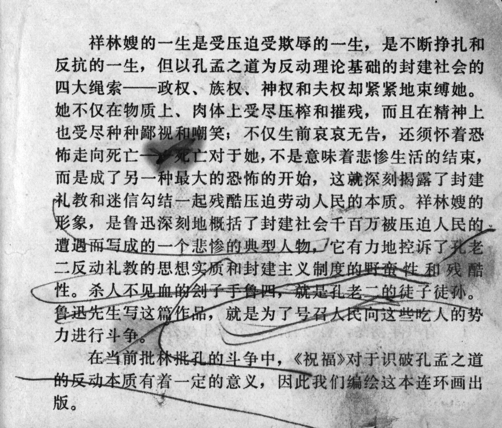



祥林嫂的一生是受压迫受欺辱的一生，是不断挣扎和反抗的一生，但以孔孟之道为反动理论基础的封建社会的四大绳索------政权、族权、神权和夫权却紧紧地束缚她。她不仅在物质上、肉体上受尽压榨和摧残，而且在精神上也受尽种种鄙视和嘲笑；不仅生前哀哀无告，还须怀着恐怖走向死亡------对于她，不是意味着悲惨生活的结束，而是成了另一种最大的恐怖的开始，这就深刻揭露了封建礼教和迷信勾结一起残酷压迫劳动人民的本质。祥林嫂的形象，是鲁迅深刻地概括了封建社会千百万被压迫人民的遭遇而写成的一个悲惨的典型人物，它有力地控诉了孔老二反动礼教的思想实质和封建主义制度的野蛮性和残酷性。杀人不见而血的刽子手鲁四，就是孔老二的徒子徒孙。鲁迅先生写这篇作品，就是为了号召人民向这些吃人的势力进行斗争。

在当前批林批孔的斗争中，《祝福》对于识破孔孟之道的反动本质有着一定的意义，困此我们编绘这本连环画出版。

<--->

The life of Xianglin's wife was a life filled with oppression and humiliation, a life of constant struggle and resistance. But the four major feudal bonds -- political authority, kinship authority, theocratic authority and patriarchic authority -- bound her tightly to the Confucian and Menzian doctrines, which serve as the basis of the reactionary feudal society. She not only suffered severely from material and physical oppression and destruction, but also suffered psychologically from all sorts of contempt and mockery. Not only did she suffer unspeakable grief during her lifetime, moreover, but she faced death with horror as well - for her, death did not mean the end of a tragic life, but the beginning of even greater terror of a different kind. This profoundly uncovers the collusive nature of feudal Confucian ethics and superstition in mercilessly suppressing the working people. The figure of Xianglin's wife is an epitome of the billions of people oppressed by feudal society. It is also a typical tragic character created by Lu Xun that powerfully denounces the reactionary essence of the Confucian ethical ideology, as well as the cruel and barbaric nature of the feudal system. Mr. Lu, the executioner who kills without the shedding of blood is a disciple of Confucius. Lu Xun wrote this work in order to call on the people to struggle against these cannibalistic forces.

In the current struggle to criticize Lin Biao and Confucius, "The New Year's Sacrifice" is of considerable significance in revealing the reactionary nature of the Confucian and Menzian doctrines, therefore we compile and publish this *lianhuanhua*.



## Further remark in the reprint:

(not shown)



本书由我社1957年首次出版，1963年修订再版，现根据读者需求，纳入"现代故事画库"系列重新出版。

<--->

This book was first published by our publishing house in 1957, revised and republished in 1963. As requested by our readers, we have now included it into our "Image Repository of Modern Stories" series for a new edition.


