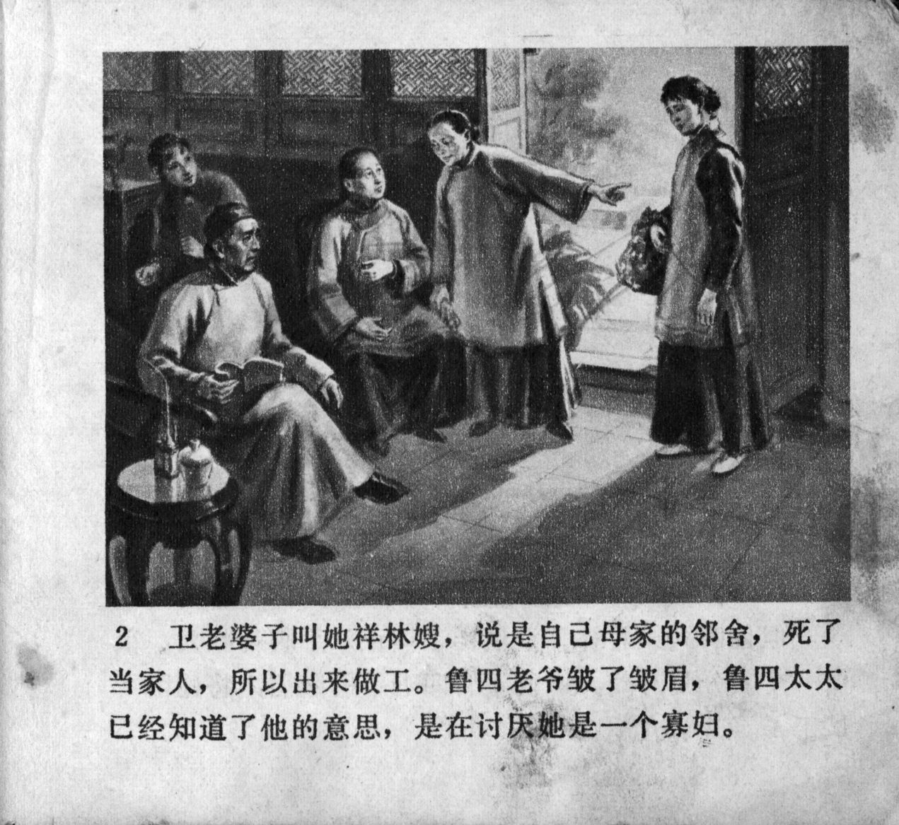



卫老婆子叫她祥林嫂，说是自己母家的邻舍，死了当家人，所以出来做工。鲁四老爷皱了皱眉，鲁四太太已经知道了他的意思，是在讨厌她是一个寡妇。

<--->

Old Wei called her Xianglin's wife, said she was her maternal family's neighbour, and she came out to work because her husband had died. Mr. Lu frowned, and his wife immediately knew what he meant, that he disliked the status of Xianglin's wife as a widow.


