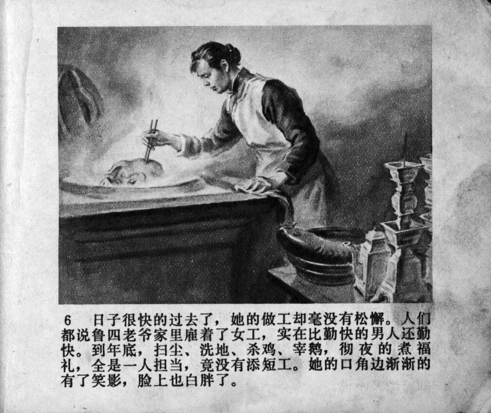



日子很快的过去了，她的做工却毫没有松懈。人们都说鲁四老爷家里雇着了女工，实在比勤快的男人还勤快。到年底，扫尘，洗地，杀鸡，宰鹅，彻夜的煮福礼，全是一人担当，竟没有添短工。她的口角边渐渐的有了笑影，脸上也白胖了。

<--->

The days passed quickly, but her work never slacked off. Everyone said the female worker employed by Mr. Lu indeed was more diligent than a diligent man. By the end of the year, sweeping the dust, washing the ground, killing the chickens, slaughtering the geese, and preparing blessing ceremonies all night long, all of which were done by her alone without additional short-term helpers. The corners of her mouth gradually had a hint of a smile, her face also grew fairer and plumber.


