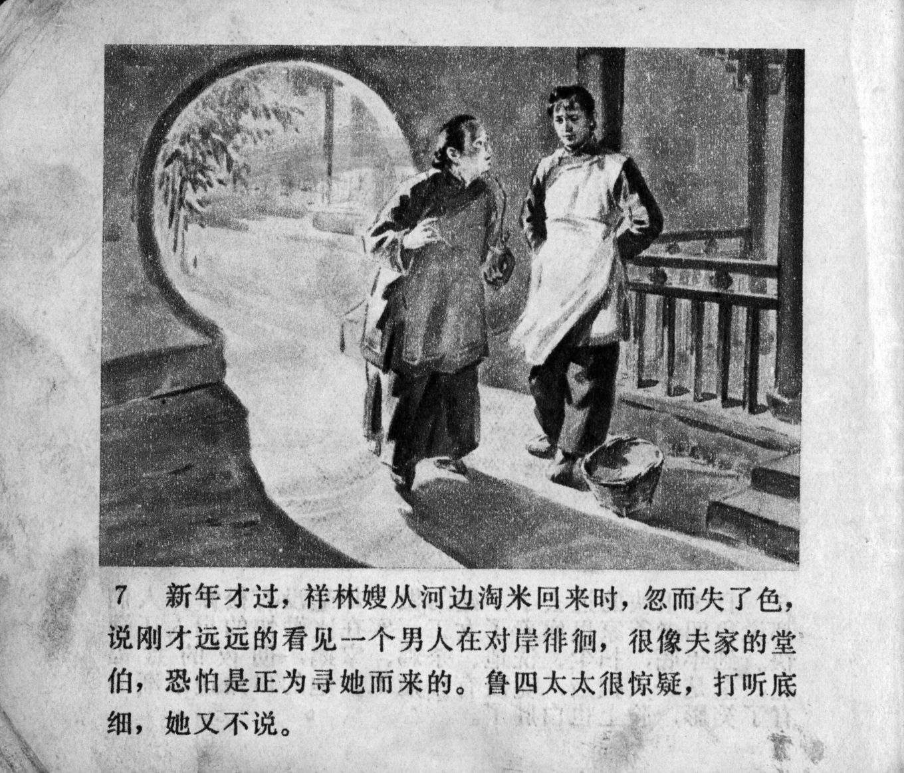



新年才过，祥林嫂从河边淘米回来时，忽而失了色，说刚才远远的看见一个男人在对岸徘徊，很像夫家的堂伯，恐怕是正为寻她而来了。鲁四太太很惊疑，打听底细，她又不说。

<--->

Just after the new year, once when Xianglin's wife came back from rinsing rice by the river, she suddenly went pale and said that she just saw from afar a man pacing up and down on the other side of the riverband, who looked very similar to her husband's cousin. She was afraid that he had come to find her. Mrs. Lu was suspicious, but when she asked for details, Xianglin's wife would not say anything.


