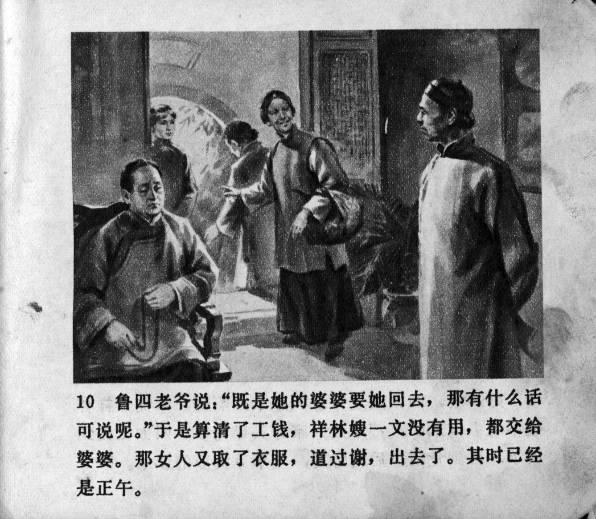



鲁四老爷说：“既是她的婆婆要她回去，那有什么话可以说呢。”于是算清了工钱，祥林嫂一文没有用，都交给婆婆。那女人又取了衣服，道过谢，出去了。其实已经是正午。

<--->

Mr. Lu said, "now that her mother-in-law wants her to go home, what can we say?" Then they settled her wages. As Xianglin's wife had not used a single coin, the entire sum was handed over to her mother-in-law. The woman picked up the clothes of Xianglin's wife, thanked Mr. Lu, and then left. It was already midday.


