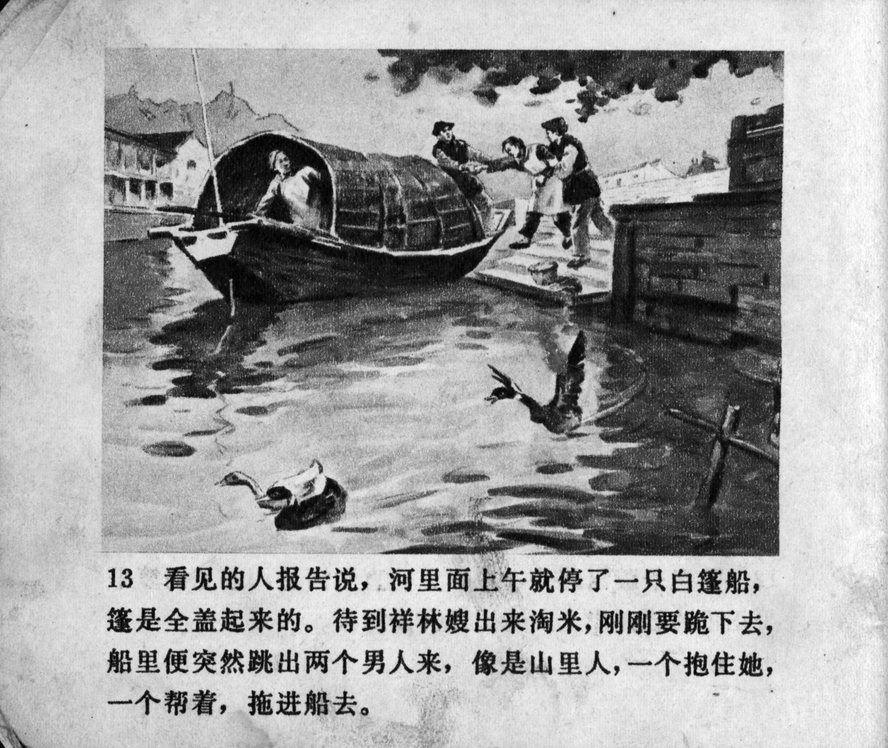



看见的人报告说，河里面上午就停了一只白篷船，篷是全盖起来的。待到祥林嫂出来淘米，刚刚要跪下去，船里便突然跳出两个男人来，像是山里人，一个抱住她，一个帮着，拖进船去。

<--->

Bystanders reported that there had been a boat moored on the river since the morning, fully covered with a white canopy. When Xianglin's wife knelt down to wash the rice, two men looking like peasants from the mountains suddenly jumped out of the boat. One man caught her and, with the help of the other, dragged her into the boat.


