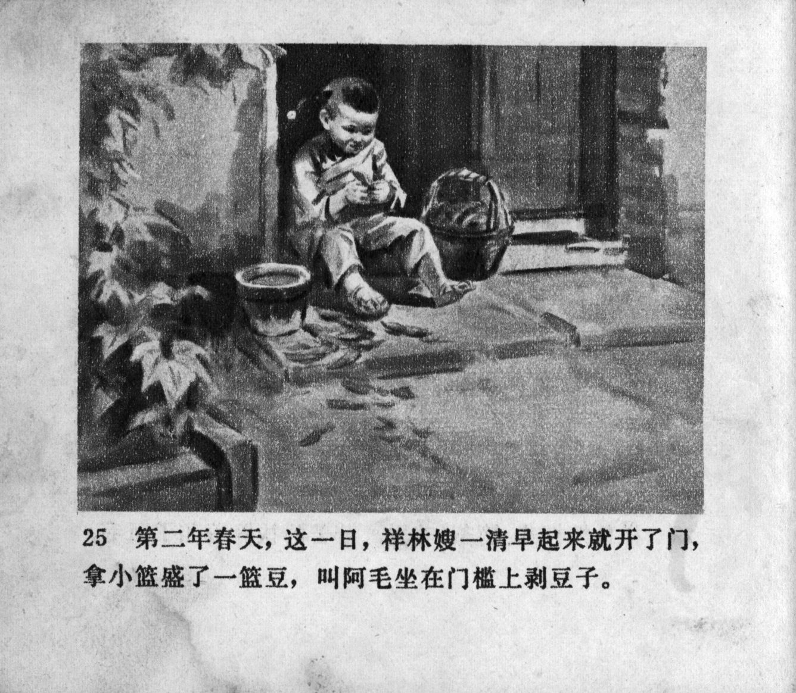



第二年春天，这一日，祥林嫂一清早起来就开了门，拿小篮盛了一篮豆，叫阿毛坐在门槛上剥豆子。

<--->

One day in the following spring, Xianglin's wife opened the door early in the morning, scooped a basketful of beans into a small basket, and called Ah Mao to sit at the threshold and shell beans.


