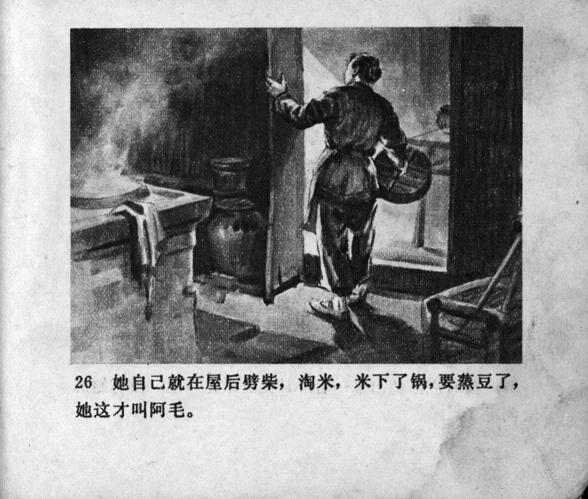



她自己就在屋后劈柴，淘米，米下了锅，要蒸豆了，她这才叫阿毛。

<--->

She herself was at the back of the house chopping firewood and rinsing rice. After putting the rice into the pot, it was time to steam the beans, and only then did she call Ah Mao.


