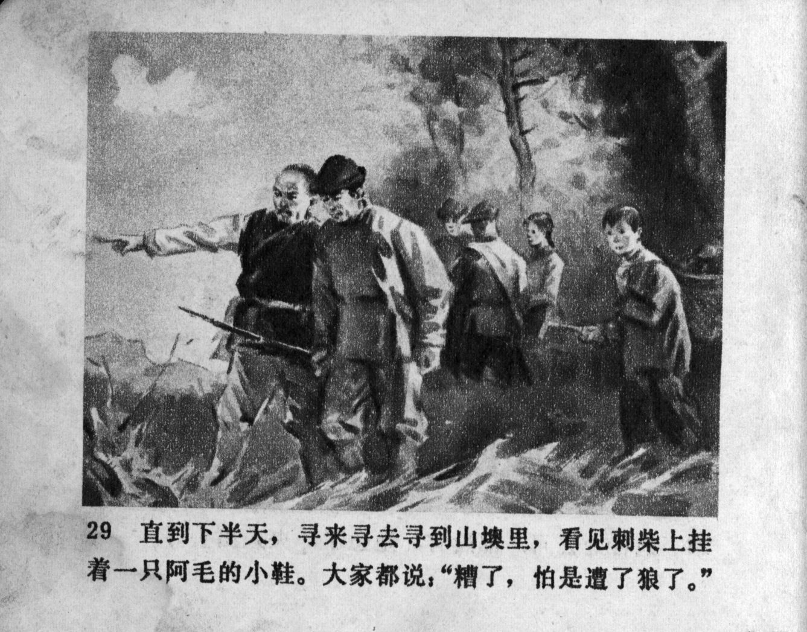



直到下半天，寻来寻去寻到山墺里，看见刺柴上挂着一只阿毛的小鞋。大家都说：“糟了，怕是遭了狼了。”

<--->

Until the afternoon, they searched all over and reached a mountain clearing, where they saw one of Ah Mao's little shoes hanging on a thorny branch. They all said: "Oh no, it looks like a wolf got him."


