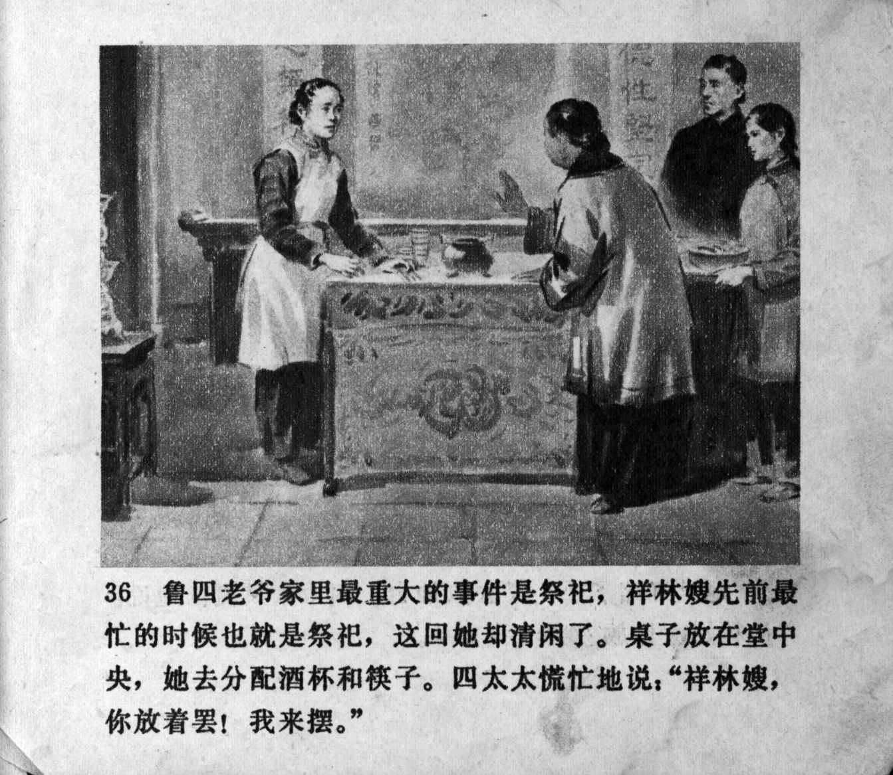



鲁四老爷家里最重大的事件是祭祀，祥林嫂先前最忙的时候也就是祭祀，这回她却清闲了。桌子放在堂中央，她去分配酒杯和筷子。四太太慌忙地说：“祥林嫂， 你放着罢！我来摆。”

<--->

Sacrificing to the ancestors was the biggest event for the family of Mr. Lu. Previously, the sacrifices were also the busiest time for Xianglin's wife. This time, however, she had nothing to do. The table was set in the centre of the hall, and she went to distribute glasses and chopsticks. Mrs. Lu rushed to say: "Xianglin's wife, leave it there! I'll do it."


