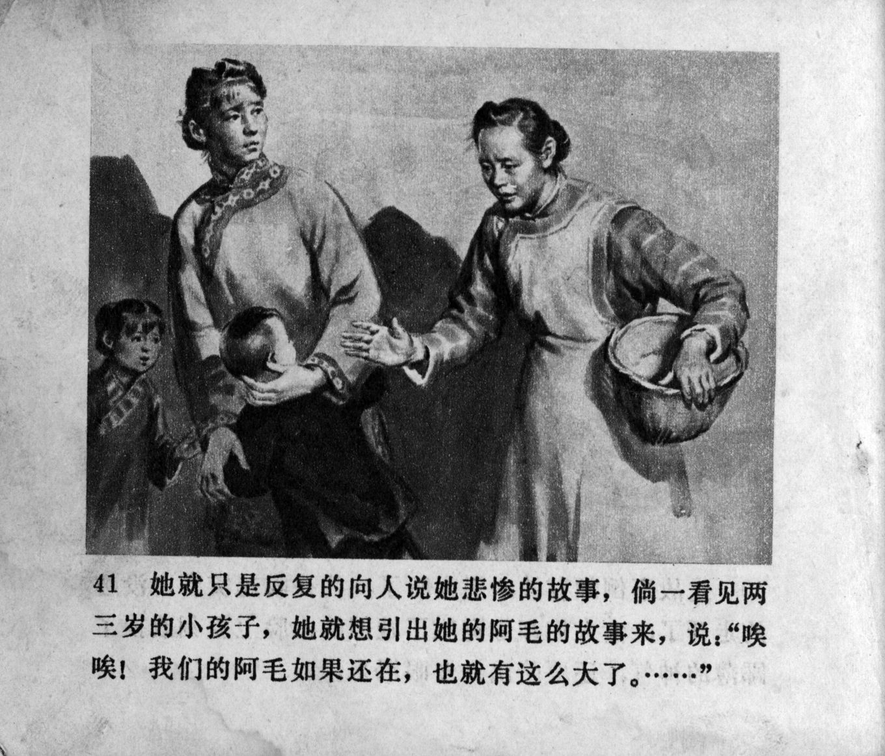



她就只是反复的向人说她悲惨的故事，倘一看见两三岁的小孩子，她就想引出她的阿毛的故事来，说：“唉唉！我们的阿毛如果还在，也就有这么大了。……”

<--->

She just kept telling people again and again about her tragedy. Whenever she saw a two- or three-year-old child, she would bring up the story about her Ah-mao, and say, "Ah ah! If our Ah-mao were still alive, he would be around that age…" 


