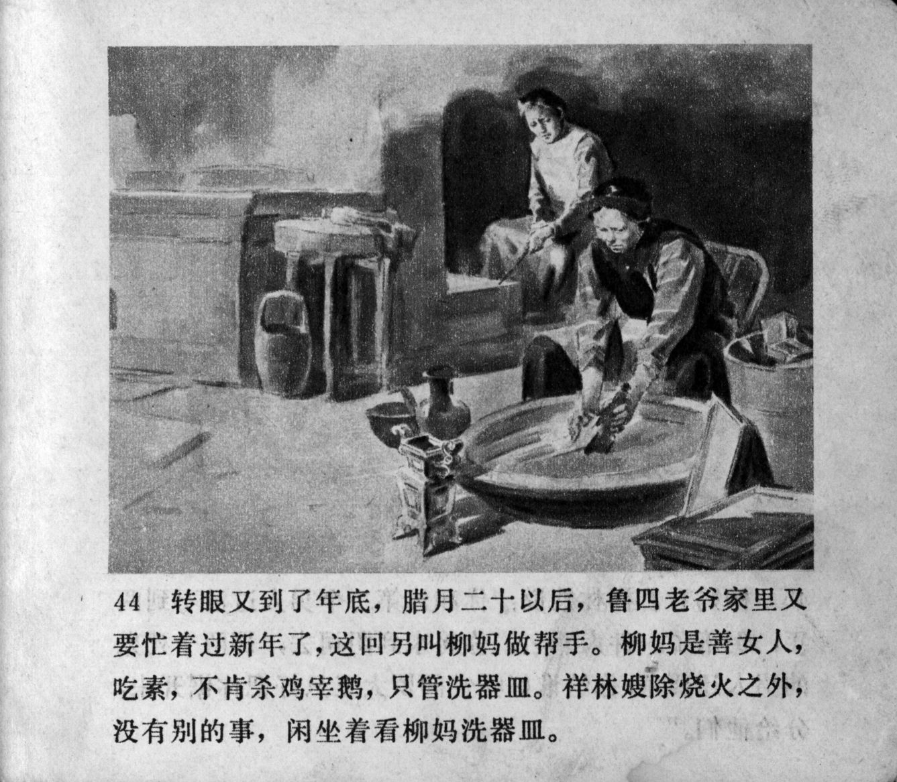



转眼又到了年底，腊月二十以后，鲁四老爷家里又要忙着过新年了，这回另叫柳妈做帮手。柳妈是善女人，吃素，不肯杀鸡宰鹅，只管洗器皿。祥林嫂除烧火之外，没有别的事，闲坐着看柳妈洗器皿。

<--->

In the blink of an eye, it was the end of another year. After the 20th day of the twelfth lunar month, the Lu household was busy with the New Year's celebration again. This time, they found an extra help, Auntie Liu. Auntie Liu was a Buddhist vegetarian woman who refused to kill chickens and geese, but merely washed the vessels. Xianglin's wife had nothing to do except tend the fire, so she sat idly watching Auntie Liu wash the vessels.


