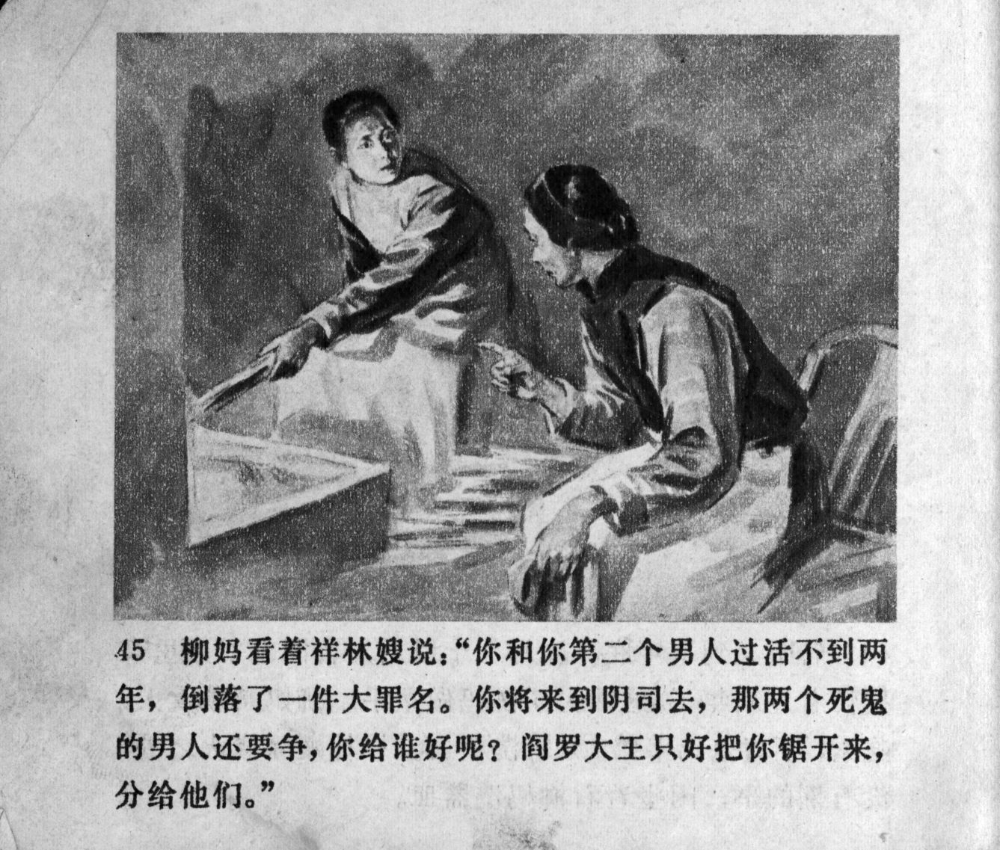



柳妈看着祥林嫂说：“你和你第二个男人过活不到两年，倒落了一件罪名。你将来到阴司去，那两个死鬼的男人还要争，你给谁好呢？阎罗大王只好把你锯开来，分给他们。”

<--->

Auntie Liu looked at Xianglin's wife and said: "You and your second husband were together for less than two years, yet you are guilty of a great sin. When you arrive in the nether world, the ghosts of those two husbands will fight, whom will you be given to? The great king Yama will have to saw you apart and divide you between them."


