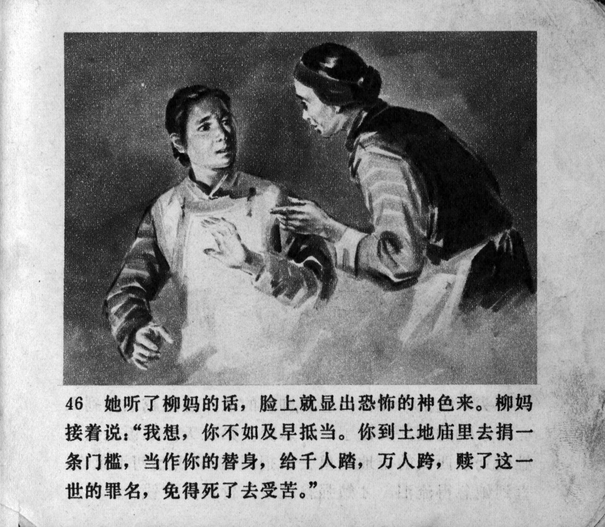



她听了柳妈的话，脸上就显出恐怖的神色来。柳吗接着说：“我想，你不如及早抵当。你到土地庙里。去捐一条门槛，当作你的替身，给千人踏，万人跨，赎了这一世的罪名，免得死了去受苦。”

<--->

When she heard Auntie Liu's words, a look of horror appeared on her face. Auntie Liu continued: "I think, it would be better if you go to compensate for it as soon as possible. Go to the Temple of the Village God. Donate a threshold, make it as your substitute, let thousands of people step on it, let tens of thousands of people cross over it in order to atone for your sins in life, so that you will not have to suffer in death."


