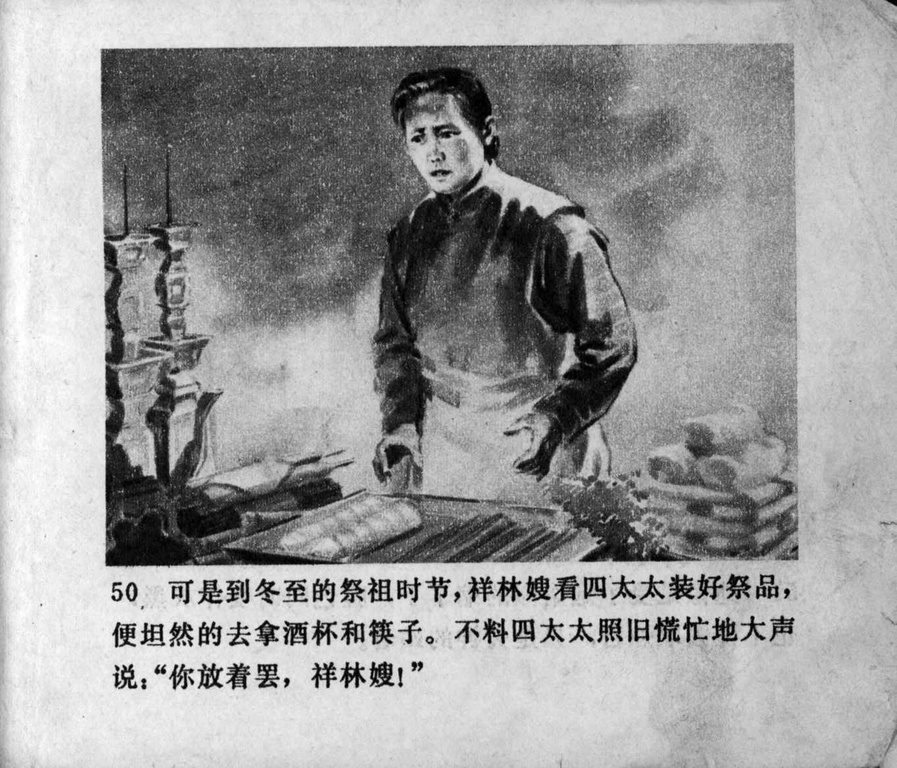



可是到冬至的祭祖时节，祥林嫂看四太太装好祭品，便坦然去拿酒杯和筷子。不料四太太照旧慌忙地大声说：“你放着罢，祥林嫂！”

<--->

When it came to the winter solstice and the sacrifices to the ancestors, Xianglin's wife saw Mrs. Lu preparing the sacrificial offerings and went to get the wine cups and chopsticks. But to her surprise, Mrs. Lu, as before, rushed to say: "Leave it there, Xianglin's wife!" 


